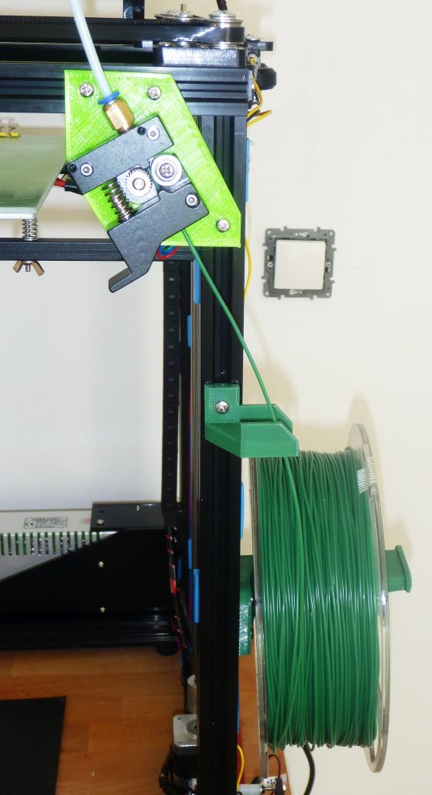

Spool support with filament guide and extruder support for aluminium profile frame (option for flat panels).
It is designed to avoid spool balancing and have steady filament traction, in order to avoid filament tangling

=======
Spool support and Bowden extruder support integrating simple filament sensor switch 
This is designed for aluminium profile frame (option for flat panels). 
Spool support have a flattened shape and is reclined to avoid spool balancing and have steady filament traction, in order to avoid filament tangling. 
 

>>>>>>> origin/master
